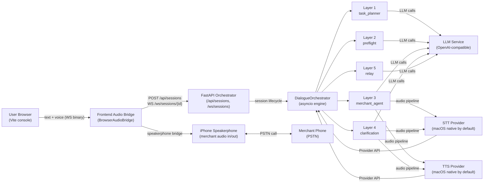
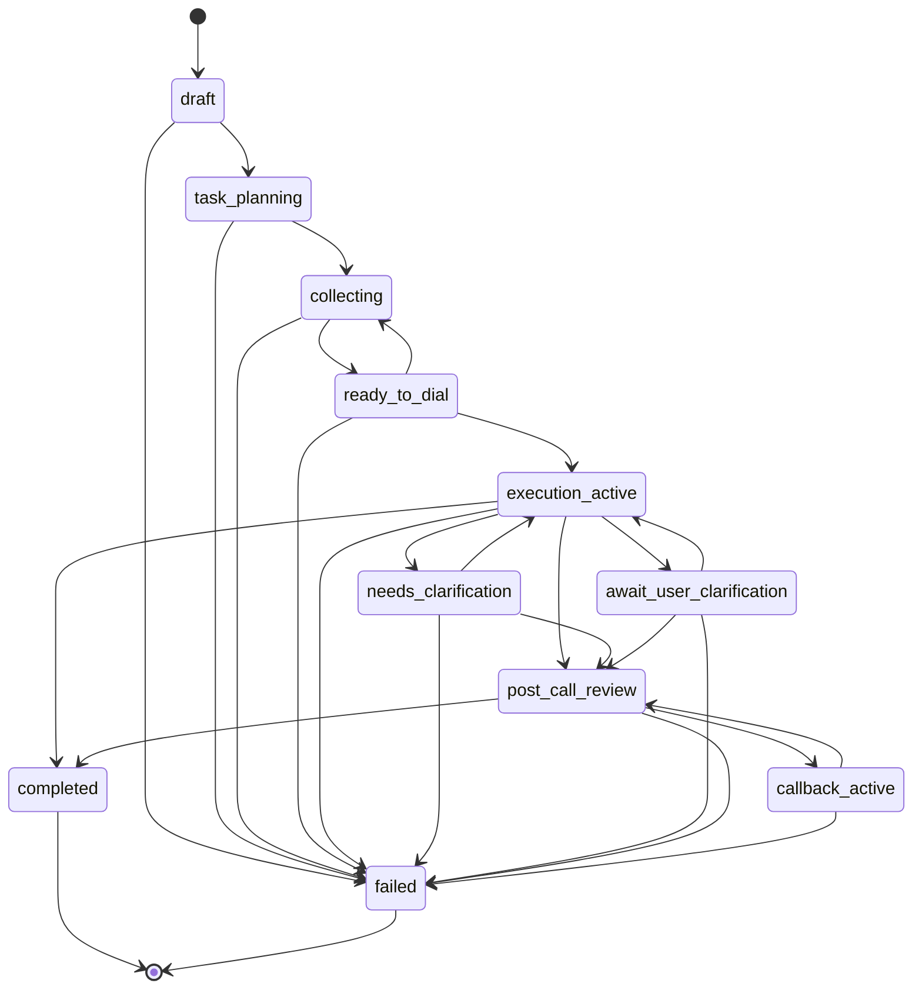

# VocalizeAI Architecture

VocalizeAI is a bilingual AI phone-agent system: a user describes a phone task
in natural language, the system collects the required information through a
conversational interface, then takes over and places a real phone call to the
merchant — handling the dialogue and relaying across languages automatically.

---

## What VocalizeAI Does

A user opens the web console and describes a task in natural language: "Book a
table for 4 at Joy Sushi, tonight at 7 pm." The system's Layer 1 (task planner)
parses this into a dynamic schema of required slots (party size, date, time, name,
phone). Layer 2 (preflight) drives a short conversational loop to collect any
missing slots from the user.

Once all high-criticality slots are filled, the user's iPhone acts as a
speakerphone bridge: the AI-generated voice is played through the speaker and
the merchant's voice is captured by the mic. Layer 3 (merchant agent) runs the
in-call dialogue, speaking to the merchant (in the merchant's language if needed)
and transcribing both sides. If clarification is needed mid-call, Layer 4 pauses
the call and asks the user; Layer 5 (relay) handles all cross-lingual translation.

The public `v0.1.0` product is packaged for macOS. It does not use a telephony
provider; the user's phone remains the physical bridge to the call, while the
Mac runs the web console, backend, LLM client, and native speech helper.

### End-to-End Request Flow (Quick Reference)

1. **User creates a session** — `POST /api/sessions` → receives
   `session_id` + `ws_url`.
2. **User sets the task** — `POST /api/sessions/{id}/task` with `{"task": "..."}` → Phase
   transitions `draft → task_planning → collecting`.
3. **User opens WebSocket** — connects to `ws_url`, receives `phase_change` + `state_update`
   frames as Layer 1 completes.
4. **Preflight loop** — user sends `text_input` frames; server responds with
   `readiness_change` frames as slots fill up; loop exits when readiness passes.
5. **Dial** — user triggers dial (or sends `text_input` with "dial now"); Phase transitions
   `collecting → ready_to_dial → execution_active`.
6. **In-call** — AI manages the call; `transcript_update` frames stream both sides in
   real-time; `clarification_request` frames pause the call if needed.
7. **Post-call** — Phase transitions to `post_call_review → completed`; user closes WS;
   client calls `DELETE /api/sessions/{id}` to clean up.

See: `src/vocalize/pipeline.py`, `src/vocalize/transports/`

---

## High-Level Pipeline



---

## The 5-Layer Dialogue Pipeline

The dialogue pipeline is a composition of five layers, each implemented as an
independent async module under `src/vocalize/dialogue/`. They share state
through `TaskState` (described in the next section).

### Layer 1 — Task Planner

**File:** `src/vocalize/dialogue/task_planner.py` (~400 lines)

**Public surface:** `TaskSchema` (frozen dataclass), `async generate_task_schema(user_request, llm)`

Layer 1 converts a free-form user request into a `TaskSchema` via a single LLM
call. The schema contains:
- `slots`: list of `SlotDef` (name, type, criticality, description, examples)
- `readiness_criteria`: natural-language description of what "ready to dial" means
- `relay_strategy`: language + voice instructions for the in-call agent
- `task_summary`: short English summary for logging

The task planner runs exactly once per session, immediately after the user sets
their task (`POST /api/sessions/{id}/task`). Its output is stored in
`TaskState.task_schema`.

See: `src/vocalize/dialogue/task_planner.py`

---

### Layer 2 — Preflight

**File:** `src/vocalize/dialogue/preflight.py` (228 lines)

**Public surface:** `detect_dial_now(text)`, `async run_preflight(state, llm, channel)`

Layer 2 runs a conversational slot-collection loop. It asks the user for each
missing high-criticality slot in turn, validates responses, and loops until one
of two exit conditions is met:
- All high-criticality slots in `TaskState.task_schema` are filled and
  `ReadinessVerdict.passed` is `True`.
- The user types "dial now" / "现在拨" (detected by `detect_dial_now`), which
  forces an immediate handover even if some slots are missing.

Slot values are stored in `TaskState.slot_values` and the readiness verdict in
`TaskState.readiness`.

See: `src/vocalize/dialogue/preflight.py`

---

### Layer 3 — Merchant Agent

**Files:** `src/vocalize/dialogue/orchestrator.py` (1437 lines),
`src/vocalize/prompts/merchant_agent_zh.md`, `src/vocalize/prompts/merchant_agent_en.md`

**Public surface:** `DialogueOrchestrator` (composition root), `Channel` (Protocol)

Layer 3 drives the in-call dialogue with the merchant. The `DialogueOrchestrator`
is the asyncio engine that owns the per-channel message lists and drives the full
session lifecycle. It bypasses `VoicePipeline.messages` to maintain independent
per-channel (user vs merchant) conversation threads.

The merchant agent:
- Speaks to the merchant in the merchant's language (per `relay_strategy`)
- Transcribes both sides via STT → `TranscriptMessage` records
- Emits `transcript_update` frames to the frontend
- Recognises when the task is done and transitions to `POST_CALL_REVIEW`

See: `src/vocalize/dialogue/orchestrator.py`

---

### Layer 4 — Clarification

**File:** `src/vocalize/dialogue/clarification.py` (369 lines)

**Public surface:** `request_clarification(...)`, `MerchantImpatienceError`, `ClarificationTimedOut`

Layer 4 handles mid-call pauses. When the merchant asks a question the system
cannot answer alone, it:
1. Pauses the merchant-side audio (keepalive filler fires every N seconds:
   "正在确认中..." / "One moment please...")
2. Sends a `clarification_request` frame to the user
3. Waits for an `ack_clarification` frame with the user's answer
4. Resumes the call

If the merchant interrupts 3 times without receiving an answer, `MerchantImpatienceError`
is raised and an `escalation_warning` frame is sent to the user. If the user does
not respond within the timeout, `ClarificationTimedOut` is raised.

See: `src/vocalize/dialogue/clarification.py`

---

### Layer 5 — Relay

**File:** `src/vocalize/dialogue/relay.py` (101 lines)

**Public surface:** `async merchant_text_to_user_lang(...)`, `async user_to_merchant(...)`, `RelayResult`

Layer 5 provides cross-lingual translation in both directions:
- `merchant_text_to_user_lang`: translates merchant speech → user's language
  (for `auto_translate_merchant` mode)
- `user_to_merchant`: translates user clarification → merchant's language before
  speaking it via TTS

Translation is triggered automatically when `user_lang ≠ merchant_lang` (per
`relay_strategy` from Layer 1). When languages match, the layer is a no-op pass-through.

See: `src/vocalize/dialogue/relay.py`

---

## TaskState & Phase Machine

### TaskState dataclass

`TaskState` is the universal task-session record. It is created at session start
and mutated by transitions throughout the session lifecycle.

**Key fields:**
- `task_schema: TaskSchema | None` — set by Layer 1; None until task is planned
- `slot_values: dict[str, Any]` — collected slot values (keys = `SlotDef.name`)
- `readiness: ReadinessVerdict | None` — set after each preflight assessment
- `phase: TaskPhase` — current phase (enum value)
- `audit_log: list[TaskAuditEntry]` — immutable append-only transition record
- `transcript: list[TranscriptMessage]` — full session transcript
- `call_segments: list[CallSegment]` — one entry per call leg
- `assumptions: list[SlotAssumption]` — uncertain assumptions surfaced to user
- `pending_callbacks: list[CallbackEntry]` — pending callback requests

**Pydantic models in `state.py`:**
- `SlotDef` — one slot definition from the task schema (name, type, criticality,
  description, examples, validation hints)
- `ReadinessVerdict` — result of a preflight readiness assessment: `passed`,
  `missing_critical` (list), `confidence` (float 0–1.0); `passed = override OR
  (not missing_critical AND confidence >= 0.7)`
- `TranscriptMessage` — one transcript entry: `id`, `role` (TranscriptRole),
  `text`, `lang`, `is_final`, `subtype` (TranscriptSubtype), `parent_id`,
  `segment_id`, `created_at`
- `CallSegment` — one call leg record: start/end timestamps, outcome, summary
- `SlotAssumption` — an uncertain assumption the system made while filling a slot;
  surfaced to user for confirmation via `uncertain_assumption_added` frame
- `CallbackEntry` — a pending callback request from the merchant

**State transitions** are the only entry point for mutating `phase`; illegal
transitions raise `DialogueOrchestratorError` and are recorded in the audit log.

See: `src/vocalize/dialogue/state.py`

### TaskPhase enum

11 phase values define the full session lifecycle:

| Phase | Meaning |
|-------|---------|
| `draft` | Session created; no task set yet |
| `task_planning` | Layer 1 running: generating `TaskSchema` |
| `collecting` | Layer 2 running: collecting slots from user |
| `ready_to_dial` | All slots filled; user can trigger dial |
| `execution_active` | In-call: Layer 3 running |
| `needs_clarification` | Merchant asked a question; awaiting system response |
| `await_user_clarification` | Layer 4 paused call; awaiting user's `ack_clarification` |
| `post_call_review` | Call ended; reviewing outcome |
| `callback_active` | Merchant called back; handling callback |
| `completed` | Task completed successfully |
| `failed` | Unrecoverable error; session terminal |

### Phase Transition Diagram

The diagram below is mechanically derived from `LEGAL_TASK_TRANSITIONS` in
`src/vocalize/dialogue/state.py:337–371`.



See: `src/vocalize/dialogue/state.py:316–371`

---

## WebSocket Protocol Surface

Each session has a single persistent WebSocket at `/ws/sessions/{id}`. The
server runs two concurrent coroutines: `recv_loop` (routes inbound frames) and
`runner.run` (drives the orchestrator). Close code `4404` means the session is
unknown or already claimed.

See: `src/vocalize/server/ws.py`, `src/vocalize/server/frames.py`

### Client → Server Frames (12 types)

All text frames are JSON with a `type` field.

| Frame type | Key fields | Semantics |
|------------|-----------|-----------|
| `text_input` | `text`, `lang_hint?`, `mode` | User typed text; `mode` is `default` or `user_takeover` |
| `mode_change` | `mode` | Switch session mode (default / user_takeover) |
| `ack_clarification` | `slot_value` | User's answer to a `clarification_request` |
| `hangup` | — | User-initiated call end |
| `set_devices` | `input_id`, `output_id`, `aec` | Set active audio devices + AEC flag |
| `trigger_callback` | `callback_id` | Trigger a pending callback entry |
| `cancel_callback` | `callback_id` | Cancel a pending callback |
| `restore_callback` | `callback_id` | Restore a cancelled callback |
| `confirm_assumption` | `assumption_id`, `choice`, `correction?`, `note?` | Confirm or correct a slot assumption |
| `set_auto_translate` | `value` | Enable/disable auto-translate for merchant speech |
| `on_demand_translate` | `transcript_id` | Request one-off translation of a transcript entry |
| `merchant_text_inject` | `text` | **Test-only** — gated by `VOCALIZE_ENABLE_TEST_FRAMES`; not part of the public protocol surface |

### Server → Client Frames (12 types)

| Frame type | Key fields | Semantics |
|------------|-----------|-----------|
| `transcript_update` | `id`, `role`, `text`, `lang`, `is_final`, `subtype`, `parent_id`, `segment_id`, `created_at` | New or updated transcript entry |
| `state_update` | `diff: dict` | Partial `TaskState` diff (JSON-serialisable subset) |
| `readiness_change` | `passed`, `missing_critical`, `confidence` | Preflight readiness verdict changed |
| `clarification_request` | `field`, `question`, `lang`, `timeout_s` | Layer 4 pause: ask user to clarify |
| `mode_ack` | `mode` | Acknowledgement of a `mode_change` |
| `error` | `code`, `message_zh`, `message_en` | Server-side error; session may continue |
| `phase_change` | `previous`, `current` | `TaskPhase` transition occurred |
| `call_segment_added` | `segment: dict` | New `CallSegment` record added |
| `segment_interrupted` | `segment_id`, `reason` | A call segment was interrupted |
| `uncertain_assumption_added` | `assumption: dict` | New `SlotAssumption` surfaced for user confirmation |
| `pending_callback_added` | `callback: dict` | New `CallbackEntry` added |
| `escalation_warning` | `reason`, `holds_used`, `message_zh`, `message_en` | Merchant impatience threshold reached |

### Binary Audio Frames

Audio frames bypass the JSON text channel and are sent as raw WebSocket binary messages.

**Inbound (client → server):** Raw PCM int16 little-endian, 16 kHz, mono. No
role byte — the only inbound source is the user's microphone (which captures
the merchant via speakerphone).

**Outbound (server → client):** 1-byte role tag prefix, followed by raw PCM
int16 little-endian, 24 kHz, mono.
- `b'U'` (`0x55`) — `ai_to_user`: AI voice for the user's ears
- `b'M'` (`0x4D`) — `ai_to_merchant`: AI voice to be played through the speakerphone toward the merchant

See: `src/vocalize/server/frames.py` — `encode_outbound_audio_chunk`, `decode_inbound_audio_chunk`

### TranscriptRole and TranscriptSubtype enums

**`TranscriptRole`** — who produced a transcript entry:
`user`, `merchant`, `ai_to_user`, `ai_to_merchant`, `merchant_to_ai`,
`user_supplement`, `user_takeover_passthrough`, `system`

**`TranscriptSubtype`** — structural type of a transcript entry:
`original`, `translation`, `user_supplement`, `user_takeover_passthrough`,
`callback_segment`, `filler`, `keepalive`

See: `src/vocalize/server/frames.py`

---

## REST Surface

The REST API is mounted at `/api/sessions`. The backend ships no
request-level authentication in v1; self-deploy operators restrict
reachability at the network or proxy layer (per-user auth is v1.x
scope — requirement `AUTH-01`).

See: `src/vocalize/server/sessions.py`, `src/vocalize/server/health.py`

### `POST /api/sessions`

**Auth:** None at the backend layer in v1 (network/proxy restriction is the
operator's responsibility).

**Request body** (`CreateSessionRequest`, all optional):
```json
{
  "preferred_voice_id": null,
  "auto_translate_merchant": true,
  "default_lang": "zh"
}
```

**Response** (`CreateSessionResponse`):
```json
{
  "session_id": "<uuid>",
  "ws_url": "ws://127.0.0.1:8000/ws/sessions/<uuid>",
  "default_lang": "zh",
  "preferred_voice_id": null,
  "auto_translate_merchant": true
}
```

See: `src/vocalize/server/sessions.py` — `CreateSessionRequest`

---

### `GET /api/sessions/{id}`

Returns a `SessionResponse` with `session_id`, `phase`, `task_schema`, and
`slot_values`. Useful for polling state without holding a WebSocket.

---

### `POST /api/sessions/{id}/task`

**Request body** (`SetTaskRequest`):
```json
{ "task": "<natural language description, 1–2000 chars>" }
```

`task` has `max_length=2000` to bound prompt-injection surface (design constraint D-09).

**Response:** `{"ok": true}`

Triggers Layer 1 (task planner) asynchronously. Phase transitions to
`task_planning` immediately, then `collecting` when the schema is ready.

---

### `DELETE /api/sessions/{id}`

Tears down the session. Returns `{"ok": true}`. Returns HTTP 409 if a WebSocket
is still actively claimed for the session — the WS must be closed first.

---

### `GET /health`

No auth required.

**Response:**
```json
{ "ok": true, "speech_provider_reachable": true }
```

- `ok` is always `true` when the server is reachable.
- `speech_provider_reachable` reports whether the configured STT/TTS Provider API
  endpoint responds to a lightweight probe.

**Note:** `GET /health` is the single health surface and already covers Provider
API reachability. There is no deeper health variant endpoint.

See: `src/vocalize/server/health.py`

---

### `GET /metrics`

Prometheus metrics endpoint, instrumented via `prometheus-fastapi-instrumentator`.
Exposes standard HTTP request counters and latency histograms.

See: `src/vocalize/server/__init__.py` — `PrometheusInstrumentator` setup

---

## Service Abstraction

VocalizeAI abstracts the three AI services (LLM, STT, TTS) behind async protocol
clients. The transport layer handles the physical audio bridge (browser ↔
speakerphone).

### LLM

OpenAI-compatible HTTP API. Default provider is DeepSeek (`OPENAI_BASE_URL=https://api.deepseek.com/v1`,
`OPENAI_MODEL=deepseek-chat`). Any OpenAI-compatible endpoint works (OpenAI,
Qwen, local Ollama, etc.) by setting `OPENAI_BASE_URL` and `OPENAI_MODEL`.
`OPENAI_THINKING_MODE=disabled` requests non-thinking output; `enabled` leaves
thinking behavior to the selected model/provider.

The `openai` Python SDK is used with streaming enabled; tool-calling is used for
slot assessment in Layer 1 and readiness assessment in preflight.

See: `src/vocalize/llm/`

---

### STT — Provider API

The orchestrator opens a streaming STT Provider API connection per session and
pipes PCM audio frames to it, receiving transcript chunks in real time. The
Mac-first public setup uses the local macOS native helper by default.

Connection target: `{VOCALIZE_STT_PROVIDER_URL}/v1/stt/stream`

See: `src/vocalize/providers/`, `docs/provider-api.md`

---

### TTS — Provider API

The orchestrator sends text to the TTS Provider API and streams back PCM audio
for playback via the browser audio bridge. The Mac-first public setup uses the
local macOS native helper by default.

Connection target: `{VOCALIZE_TTS_PROVIDER_URL}/v1/tts/stream`

Voice selection is provider-defined. The public framework only requires the
Provider API contract, not a specific model or platform.

See: `src/vocalize/providers/`, `docs/provider-api.md`

---

### Transport — Browser Audio Bridge

The audio transport is a single WebSocket per session. The frontend
`BrowserAudioBridge` component captures microphone audio (at 16 kHz) and sends
it as binary frames; it receives binary frames from the server (tagged with the
role byte) and routes them to the correct audio output.

Two concurrent coroutines run on the server side: `recv_loop` handles inbound
frames (text JSON + binary PCM), and `runner.run` drives the dialogue orchestrator.

Close code `4404`: session unknown or already claimed by another WebSocket.

See: `src/vocalize/server/ws.py`, `frontend/lib/audio*`, `frontend/components/BrowserAudioBridge*`

---

## Where Things Live

| Capability | Primary file(s) |
|------------|-----------------|
| App composition root | `src/vocalize/server/__init__.py` |
| Session REST routes | `src/vocalize/server/sessions.py` |
| WebSocket handler | `src/vocalize/server/ws.py` |
| Health endpoint | `src/vocalize/server/health.py` |
| WS frame schemas | `src/vocalize/server/frames.py` |
| Layer 1: task planner | `src/vocalize/dialogue/task_planner.py` |
| Layer 2: preflight | `src/vocalize/dialogue/preflight.py` |
| Layer 3: merchant agent (prompts) | `src/vocalize/prompts/merchant_agent_zh.md`, `src/vocalize/prompts/merchant_agent_en.md` |
| Layer 3: orchestrator engine | `src/vocalize/dialogue/orchestrator.py` |
| Layer 4: clarification | `src/vocalize/dialogue/clarification.py` |
| Layer 5: relay/translation | `src/vocalize/dialogue/relay.py` |
| TaskState + TaskPhase + transitions | `src/vocalize/dialogue/state.py` |
| LLM client | `src/vocalize/llm/` |
| STT client | `src/vocalize/stt/` |
| TTS client | `src/vocalize/tts/` |
| Transport (audio bridge) | `src/vocalize/transports/` |
| Post-call review | `src/vocalize/reflection/` |
| Env/config loading | `src/vocalize/config.py` |
| Asyncio main pipeline | `src/vocalize/pipeline.py` |
| Frontend (React + Vite) | `frontend/` |
| macOS speech helper | `macos/VocalizeSpeechProvider/` |
| Backend tests (pytest) | `tests/` |
| Integration tests (Playwright) | `tests/integration/` |

---

## Security Posture

The security controls relevant to the architecture are documented here for
API consumers and security researchers. VocalizeAI is a self-deploy
project (no centrally hosted instance); report security-relevant findings
via GitHub Issues — same channel as any other bug.

### Local-Only Default

The public product binds to `127.0.0.1` by default and is designed for a local
macOS install. Operators who expose it beyond localhost must provide their own
network boundary and configure the canonical WebSocket base URL.

### Task Length Bound (D-09)

`SetTaskRequest.task` has `max_length=2000` enforced by Pydantic. This bounds
the prompt-injection surface for Layer 1's LLM call.

### CORS Configuration (D-10)

CORS is configured per `VOCALIZE_CORS_ORIGINS`. In non-localhost mode, it
defaults to the configured production origin. `allow_methods` is restricted to
`["GET", "POST", "DELETE"]`. The frontend calls FastAPI directly. In production,
FastAPI can also serve the built Vite bundle from `frontend/dist`.

See: `src/vocalize/server/__init__.py`

### WS Base URL Startup Guard (D-11)

On startup, `create_app()` raises `RuntimeError` if `VOCALIZE_HOST != "127.0.0.1"`
and `VOCALIZE_WS_BASE_URL` is unset. This prevents Host-header spoofing in
production by forcing the operator to declare the canonical WS base URL explicitly.

### Test-Frame Gating

The `merchant_text_inject` WS frame type (for AI-merchant integration tests) is
only enabled when `VOCALIZE_ENABLE_TEST_FRAMES=1` is set. This env var must not
be present in production `.env` files.

See: `src/vocalize/server/ws.py`, `src/vocalize/server/sessions.py`

---

## Further Reading

- **[docs/deploy/local.md](docs/deploy/local.md)** — local development setup and env-var reference
- **[docs/provider-api.md](docs/provider-api.md)** — STT/TTS Provider API
- **[CONTRIBUTING.md](../CONTRIBUTING.md)** — Contributor flow, code style, commit conventions
